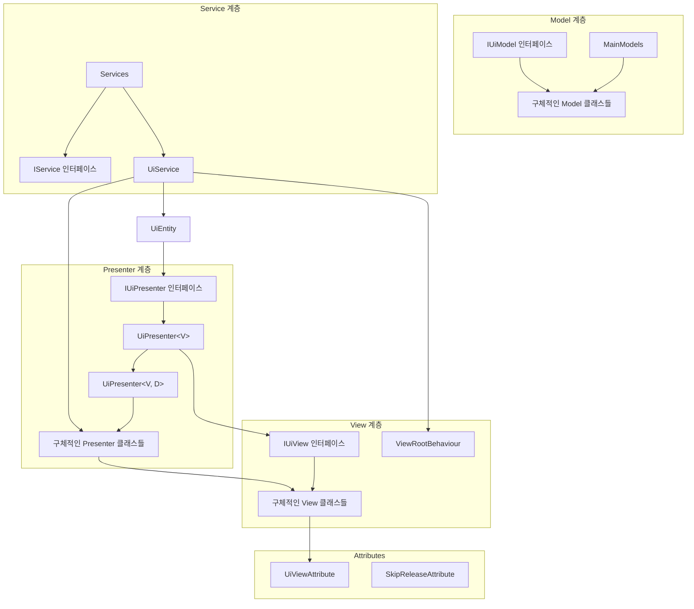
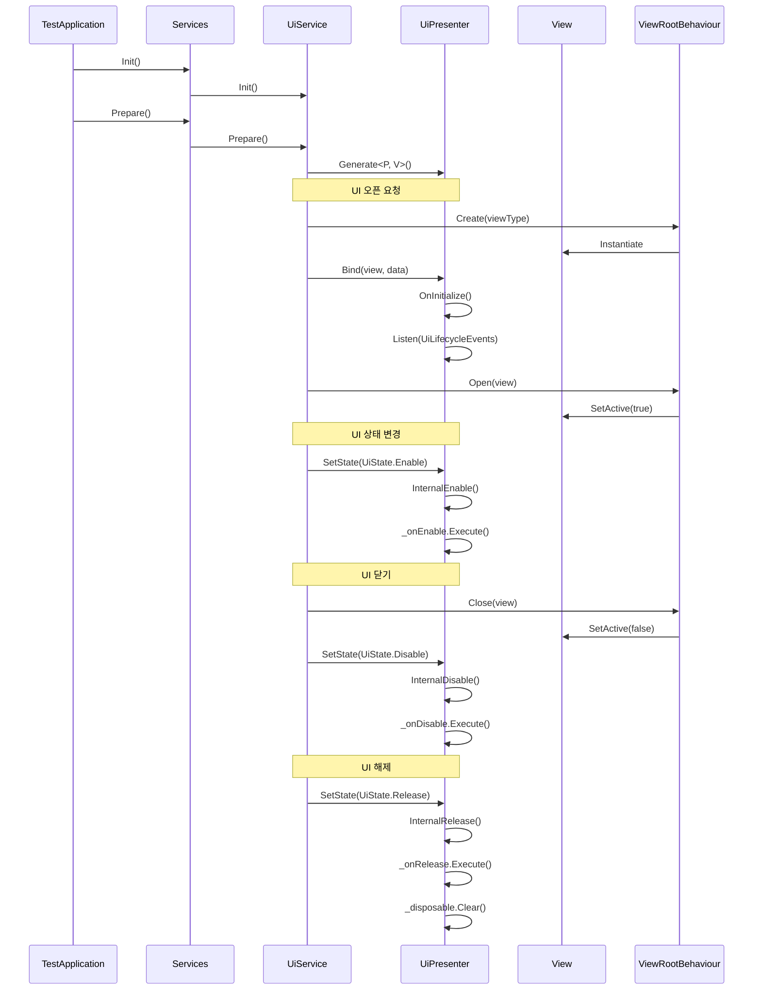

# UniRx 기반 UI 관리 시스템

Unity 환경에서 UniRx를 활용한 반응형 UI 관리 시스템입니다. MVP(Model-View-Presenter) 패턴을 기반으로 설계되었으며, 이벤트 주도(Event-Driven) 방식으로 UI 라이프사이클을 관리합니다.

## 📋 주요 기능

- **UniRx 기반 반응형 아키텍처**: 상태 변경 및 이벤트에 반응하는 UI 시스템
- **MVP 패턴 구현**: 모델, 뷰, 프레젠터 분리를 통한 관심사 분리
- **이벤트 주도 설계**: 관심 있는 이벤트 시점만 정의하는 유연한 구조
- **어트리뷰트 기반 메타데이터**: 프리팹 경로, 레이어, 포커스 상태 등을 어트리뷰트로 정의
- **UI 라이프사이클 관리**: Enable, Disable, Release 등 UI 상태 전환 관리
- **포커스 및 Escape 키 처리**: Modal, Fullscreen 등 포커스 상태에 따른 UI 처리

## 🏗️ 아키텍처

### MVP 아키텍처 다이어그램



### UI 라이프사이클 다이어그램



## 📁 프로젝트 구조

```
Unity-UI-System/
├── Attributes/                   # 어트리뷰트 정의
│   ├── UiViewAttribute.cs       # UI 뷰 메타데이터 정의
│   └── SkipReleaseAttribute.cs  # 릴리즈 스킵 설정
│
├── Core/                         # 코어 시스템
│   ├── IService.cs              # 서비스 인터페이스
│   ├── TestApplication.cs       # 애플리케이션 진입점
│   └── GlobalAPI.cs             # 전역 API 접근점
│
├── Data/                         # 데이터 정의
│   ├── EUILayer.cs              # UI 레이어 열거형
│   └── EUIFocusState.cs         # UI 포커스 상태 열거형
│
├── Define/                       # 인터페이스 및 정의
│   ├── IUiView.cs               # UI 뷰 인터페이스
│   ├── IUiPresenter.cs          # UI 프레젠터 인터페이스
│   ├── IUiModel.cs              # UI 모델 인터페이스
│   ├── IResetableModel.cs       # 초기화 가능한 모델 인터페이스
│   ├── UiPresenter.cs           # 기본 프레젠터 구현
│   └── UiEntity.cs              # UI 엔티티 정의
│
├── Extensions/                   # 확장 메서드
│   ├── GameObjectExtension.cs   # GameObject 확장
│   └── StringExtension.cs       # 문자열 확장
│
├── Models/                       # 모델 구현
│   ├── MainModels.cs            # 메인 모델 컨테이너
│   ├── TestModel.cs             # 테스트 모델
│   └── UiStateModel.cs          # UI 상태 모델
│
├── Services/                     # 서비스 구현
│   ├── Services.cs              # 서비스 컨테이너
│   ├── UiService.cs             # UI 관리 서비스
│   └── TestService.cs           # 테스트 서비스
│
└── UI/                           # UI 구현
    ├── ViewRootBehaviour.cs     # UI 루트 관리
    ├── TestView.cs              # 테스트 뷰
    ├── TestPresenter.cs         # 테스트 프레젠터
    ├── TestWithDataView.cs      # 데이터 바인딩 테스트 뷰
    └── TestWithDataPresenter.cs # 데이터 바인딩 테스트 프레젠터
```

## 💡 주요 컴포넌트 설명

### UiViewAttribute

UI 뷰의 메타데이터를 정의하는 어트리뷰트입니다. 프리팹 경로, 레이어, 순서, 포커스 상태 등을 설정합니다.

```csharp
[UiView("TestPopup", layer: EUILayer.Popup, focusState: EUIFocusState.Modal)]
public class TestView : MonoBehaviour, IUiView
```

### UiPresenter

뷰와 모델을 연결하는 프레젠터의 기본 추상 클래스입니다. UI 라이프사이클 이벤트를 관리하고, 반응형 구독을 처리합니다.

```csharp
public abstract class UiPresenter<V> : IEscapable, IUiPresenter where V : IUiView
```

### 데이터 바인딩 지원 UiPresenter

추가 데이터와 함께 뷰를 바인딩할 수 있는 확장 프레젠터입니다.

```csharp
public abstract class UiPresenter<V, D> : UiPresenter<V> where V : IUiView where D : IPresenterData
```

### UiService

UI 생성, 열기, 닫기, 해제 등의 작업을 관리하는 서비스입니다.

```csharp
public class UiService : IService
```

### ViewRootBehaviour

Unity 게임 오브젝트 레벨에서 UI를 관리하는 컴포넌트입니다. 레이어 관리, 인스턴스화, 정렬 등을 담당합니다.

```csharp
public class ViewRootBehaviour : MonoBehaviour
```

## 🔄 작동 방식

### UI 오픈 프로세스

1. `UiService.Open<T>()` 메서드 호출
2. 해당 타입의 프레젠터와 뷰 타입을 찾음
3. 뷰가 생성되지 않았다면 `ViewRootBehaviour.Create()` 호출하여 생성
4. 프레젠터에 뷰와 데이터 바인딩
5. `ViewRootBehaviour.Open()` 호출하여 뷰 활성화
6. 프레젠터의 상태를 `UiState.Enable`로 변경하여 이벤트 발생

### UI 닫기 프로세스

1. `UiService.Close<T>()` 메서드 호출
2. 해당 타입의 프레젠터와 뷰 찾음
3. `ViewRootBehaviour.Close()` 호출하여 뷰 비활성화
4. 프레젠터의 상태를 `UiState.Disable`로 변경하여 이벤트 발생

## 📝 예제 코드

### View 예제

```csharp
[UiView("TestPopup", layer: EUILayer.Popup, focusState: EUIFocusState.Modal)]
public class TestView : MonoBehaviour, IUiView
{
    public Button OkButton { get; private set; }
    public Button CancelButton { get; private set; }
    public TextMeshProUGUI TitleText { get; private set; }
    public TextMeshProUGUI ContentText { get; private set; }

    public void Awake()
    {
        OkButton = transform.Find<Button>("Ok").Assert();
        CancelButton = transform.Find<Button>("Cancel").Assert();
        TitleText = transform.Find<TextMeshProUGUI>("TitleText").Assert();
        ContentText = transform.Find<TextMeshProUGUI>("ContentText").Assert();
    }

    public bool Loaded { get; set; }
    public bool Opened { get; set; }
}
```

### Presenter 예제

```csharp
public class TestPresenter : UiPresenter<TestView>
{
    private UiLifecycleEvents _uiLifecycleEvents;
    protected override UiLifecycleEvents UiLifecycleEvents => _uiLifecycleEvents;

    // 최초 생성시 1회 호출
    public override void OnInitialize()
    {
        // 관심 이벤트 설정
        _uiLifecycleEvents = new UiLifecycleEvents
        {
            OnEnable = Enable, OnDisable = Disable
        };

        // rx 설정
        InitializeRx();
    }

    private void InitializeRx()
    {
        BindView.OkButton.OnClickAsObservable().Subscribe(_ =>
        {
            //View의 버튼 이벤트를 요청
        }).AddTo(_disposable);

        BindView.CancelButton.OnClickAsObservable().Subscribe(_ =>
        {
            //View의 버튼 이벤트를 요청
        }).AddTo(_disposable);

        GlobalAPI.App.MainModels.TestModel.TestValue0.Subscribe(_ =>
        {
            // 모델의 이벤트 처리
        }).AddTo(_disposable);
    }

    // OnEnable 시점 로직 정의
    private void Enable()
    {
        BindView.TitleText.text = "타이틀";
        BindView.ContentText.text = "초기화";
    }

    // OnDisable 시점 로직 정의
    private void Disable()
    {
    }
}
```

### Model 예제

```csharp
public class TestModel : IUiModel
{
    public readonly IntReactiveProperty TestValue0 = new();
    public readonly BoolReactiveProperty TestValue1 = new();
    public readonly StringReactiveProperty TestValue2 = new();

    public void OnInitialize()
    {
    }

    public void OnRelease()
    {
    }

    public void OnSceneChange()
    {
    }

    public void SetTestValue0(int value)
    {
        TestValue0.Value = value;
    }

    public void SetTestValue1(bool value)
    {
        TestValue1.Value = value;
    }

    public void SetTestValue2(string value)
    {
        TestValue2.Value = value;
    }
}
```

## 📚 주요 특징 및 이점

1. **반응형 프로그래밍**: UniRx를 활용한 반응형 이벤트 처리로 코드 간결화
2. **관심사 분리**: MVP 패턴을 통한 UI 로직과 비즈니스 로직 분리
3. **이벤트 주도 설계**: 필요한 이벤트만 구독하여 효율적인 처리
4. **선언적 메타데이터**: 어트리뷰트를 통한 UI 속성 정의로 가독성 향상
5. **유연한 라이프사이클**: Enable, Disable, Release 등 다양한 상태 관리
6. **포커스 시스템**: Modal, Fullscreen 등 다양한 포커스 상태 지원
7. **ESC 키 처리**: 계층적 UI 시스템에서의 ESC 키 이벤트 처리

## 📝 라이선스

이 프로젝트는 MIT 라이선스를 따릅니다.
